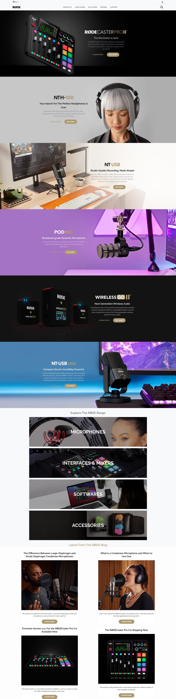

# RODE-Clone

# RODE Clone

> Project 18

<table>
<tr>
<td>
  A landing page designed using HTML & TailwindCSS.
</td>
</tr>
</table>

### Skills Gained from this

- I have Learned how to use background image property in TailwindCSS.
- Since this is built using TailwindCSS, I applied the mobile first approach and building a site with this approach makes things easier.

### Screenshot

## Device support

The site is compatible with almost all screen sizes except for watches.

## Author

